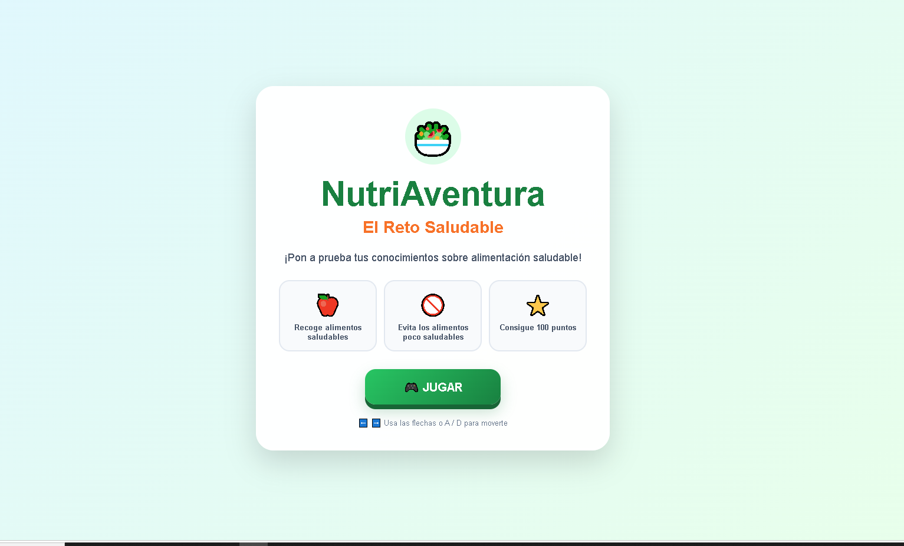
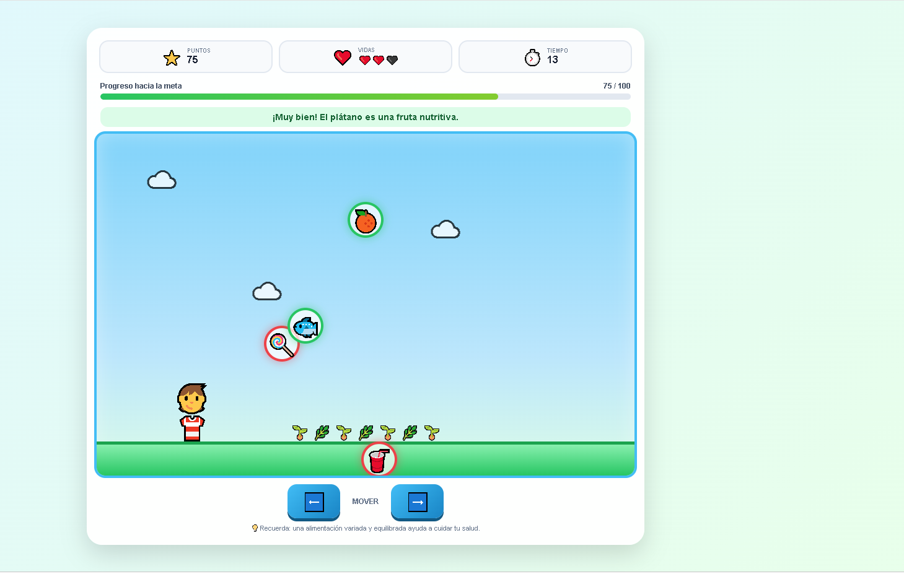
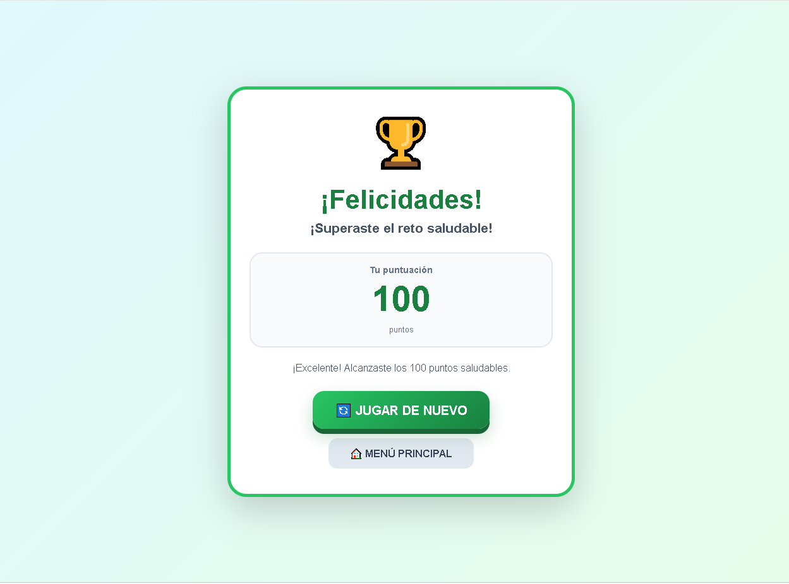

# 🥗 NutriAventura - El Reto Saludable

## Descripción
**NutriAventura - El Reto Saludable** es un videojuego educativo de acción y recolección 2D diseñado para fomentar hábitos de alimentación saludable en los niños y jóvenes. El jugador controla a un personaje que debe recolectar alimentos nutritivos (como frutas y verduras) que caen del cielo, al mismo tiempo que esquiva la comida chatarra o poco saludable. El juego promueve la concientización sobre la nutrición mediante mecánicas dinámicas de esquivar y capturar elementos en pantalla en un tiempo límite.

## Objetivo del jugador
Desplazar al personaje a lo largo de la pantalla para atrapar alimentos saludables y alcanzar una meta de **100 puntos** en un límite de tiempo de **45 segundos**, conservando al menos una de las **3 vidas** iniciales.

### Objetivos específicos
* Capturar alimentos saludables (como manzanas 🍎) para sumar puntos e incrementar la barra de progreso.
* Esquivar alimentos no saludables (🚫) para no perder vidas (❤️) ni reiniciar el progreso.
* Alcanzar los 100 puntos antes de que el temporizador de 45 segundos llegue a cero.
* Mantenerse con vida el tiempo suficiente para completar el reto y obtener la victoria.

## Mecánica principal
El juego se basa en un bucle interactivo de recolección y esquive 2D en tiempo real:

1. **Fase de Generación y Caída:** Caen distintos tipos de alimentos (saludables y no saludables) desde la parte superior del área de juego (`#gameArea`) a velocidad constante.
2. **Fase de Desplazamiento y Colisión:** El jugador mueve horizontalmente al personaje de izquierda a derecha. Si el personaje colisiona con un alimento saludable, suma puntos y llena la barra de progreso; si colisiona con comida no saludable, pierde una vida.
3. **Fase de Estado y Resultado:** Se actualizan continuamente las vidas, el tiempo restante y los puntos (`#score`). Si el jugador alcanza los 100 puntos, avanza a la pantalla de Victoria (`#winScreen`); si pierde sus 3 vidas o se agota el tiempo, pasa a la pantalla de Derrota (`#loseScreen`).

## Género
**Educational / Arcade / Catching Game / Casual**  
El proyecto se enmarca en el género arcade de recolección en tiempo real enfocado en la educación nutricional y salud.

## 🎮 Controles

| Elemento | Teclado | Botones en Pantalla | Función |
| :--- | :--- | :--- | :--- |
| **MOVER IZQUIERDA** | Flecha Izquierda `←` / Tecla `A` | Botón `⬅️` (`#leftButton`) | Mueve al personaje hacia la izquierda. |
| **MOVER DERECHA** | Flecha Derecha `→` / Tecla `D` | Botón `➡️` (`#rightButton`) | Mueve al personaje hacia la derecha. |
| **NAVEGACIÓN / MENÚ** | Mouse / Click / Tap | Botones `🎮 JUGAR`, `🔄 JUGAR DE NUEVO`, `🏠 MENÚ PRINCIPAL` | Iniciar la partida, reiniciar el juego o regresar al menú principal. |

> *El juego incluye controles en pantalla (`.mobile-controls`) optimizados para ser totalmente ejecutable en smartphones, tablets y pantallas táctiles.*

## Tecnologías utilizadas
* **HTML5:** Maquetación semántica estructurada en pantallas interactivas (`#menuScreen`, `#gameScreen`, `#winScreen`, `#loseScreen`), barra de progreso (`.progress-bar`), área del jugador y HUD de indicadores.
* **CSS3:** Estilizado visual vibrante y accesible, animaciones decorativas (como nubes flotantes `.cloud`), maquetación flexbox/grid para pantallas responsivas y diseño de menús tipo tarjeta.
* **JavaScript (Vanilla):** Lógica del bucle de juego, temporizador de 45 segundos, generación y animación de objetos que caen, detección de colisiones 2D y gestión del flujo de pantallas (Menú, Victoria, GameOver).
* **Security & Best Practices:** Código modular sin dependencias externas para garantizar la ejecución fluida en navegadores modernos.

## Capturas de pantalla

### Pantalla inicial
*(Espacio reservado para la captura de la pantalla de inicio con el título "NutriAventura", las instrucciones breves y el botón de inicio)*

### Gameplay (Acción de Recolección y HUD)
*(Espacio reservado para la captura del juego en ejecución mostrando al personaje atrapando alimentos, las nubes, la barra de progreso y las vidas)*

### Resultado (Pantalla de Victoria / Derrota)
*(Espacio reservado para la captura del panel final con la puntuación acumulada y los mensajes de aprendizaje nutricional)*

## Jugar
🎮 **Jugar NutriAventura - El Reto Saludable**  
▶️ **[JUGAR AHORA](https://ludcuba2019-boop.github.io/game-development-portfolio/NutriAventura/?utm_source=chatgpt.com)** *(Enlace configurable a GitHub Pages)*

Para jugar localmente, clona el repositorio o descarga el proyecto y abre el archivo `index.html` en cualquier navegador web moderno.

## 🤖 Uso de Inteligencia Artificial
Durante el desarrollo del proyecto se aplicó una metodología asistida por **Inteligencia Artificial Generativa** como apoyo técnico e instruccional.

La inteligencia artificial fue utilizada para:
* **Estructuración del DOM y Vistas:** Creación de un sistema de navegación por pantallas simples e intuitivo basado en clases activas.
* **Cálculo de Colisiones y Caída:** Lógica en JavaScript para controlar la generación aleatoria de elementos saludables/no saludables y la detección de impacto con el jugador.
* **Diseño de Interfaz Adaptativa:** Maquetación CSS de los controles táctiles inferiores y la barra de progreso para una excelente usabilidad en dispositivos móviles.
* **Documentación Técnica:** Estructuración y redacción en formato Markdown para el repositorio del proyecto.

## Lo que aprendí
Durante el desarrollo de este proyecto se consolidaron los siguientes aprendizajes:

* A coordinar el cambio dinámico de pantallas/vistas dentro de una SPA (Single Page Application) sin recargar la página.
* A implementar contadores de vidas con íconos visuales y barras de progreso vinculadas dinámicamente a las variables de estado en JavaScript.
* A estructurar mecánicas arcade sencillas donde el feedback al jugador (mensajes educativos) refuerza directamente el objetivo didáctico.
* A integrar botones táctiles universales para garantizar la jugabilidad tanto en escritorio como en dispositivos móviles.

## Mejoras futuras
Para futuras versiones del juego se plantean las siguientes mejoras:

* **Categorías de Alimentos:** Añadir una mayor diversidad de frutas, verduras, legumbres e hidratos de carbono con diferentes puntuaciones.
* **Power-Ups y Bonificaciones:** Inclusión de ítems especiales como la "Manzana Dorada" (puntos dobles) o el "Escudo Nutritivo" (inmunidad temporal a la comida chatarra).
* **Niveles de Dificultad:** Modos con tiempo reducido o mayor velocidad de caída de la comida chatarra a medida que el jugador aumenta su puntaje.
* **Efectos de Sonido:** Incorporación de efectos sonoros (Web Audio API) para las capturas correctas, daño por alimentos no saludables y música alegre de fondo.

## Autor
**Ludwing Leonel Cuba Condori**  
*Estudiante de Game Development.*  
Este proyecto fue desarrollado como parte de las actividades prácticas de la asignatura *Game Development*.

## Contexto académico
* **Asignatura:** Game Development  
* **Unidad:** Desarrollo de videojuegos interactivos 2D y contenido educativo  
* **Proyecto:** NutriAventura - El Reto Saludable  
* **Tipo:** Prototipo de videojuego educativo arcade asistido por IA
